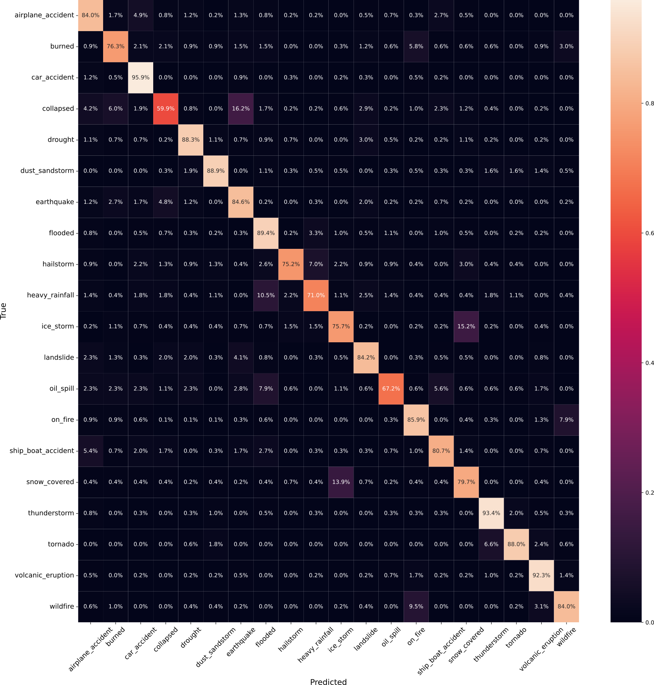

# Classification of Disaster-Related Images

## Attention Visualization

## Confusion Matrix

## Learning Curves

## Acknowledgements
- [SwiftFormer](https://github.com/Amshaker/SwiftFormer)
- [Incidents1M-Dataset](http://incidentsdataset.csail.mit.edu/)
